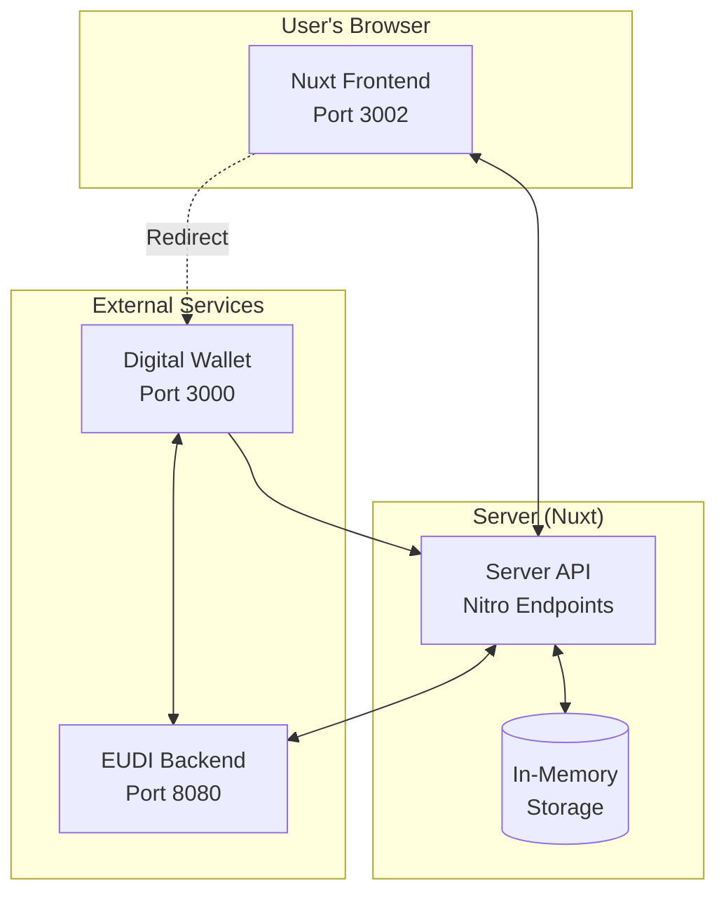
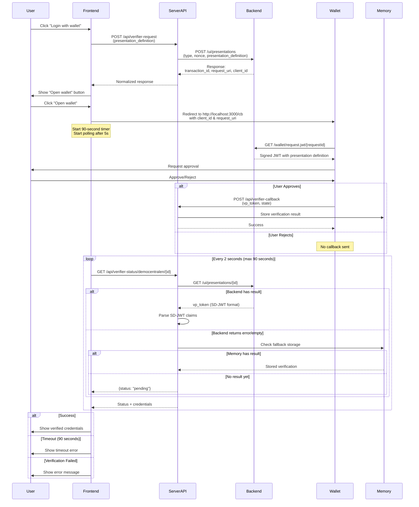

# wallet-verifier-test-web

[](https://api.reuse.software/info/github.com/diggsweden/wallet-verifier-test-web)
[](https://scorecard.dev/viewer/?uri=github.com/diggsweden/wallet-verifier-test-web)


Demo application demonstrating how a relying party may implement authentication using EUDI wallet verification.

## Quick Start

### Development

```bash
npm run dev
```

### Testing

```bash
npm run test        # watch mode
npm run test:once   # single run
```

### Docker Setup

```bash
./docker/run-ngrok.sh
```

Access the verifier at the ngrok URL displayed by the script.

## Architecture



### Verification Flow


## Demo websites

This app contains multiple demo-pages to illustrate different scenarios
of claimed attributes from a wallet. Each web page are represented as a
*.vue file in the "pages" folder.

### Components

#### Start page

```
pages/index.vue
```

The index page is the default start page of the app. It contains links to
the sub-pages representing each relaying party web page used for demo .

#### Relaying party demo page

```
pages/vaccincentralen.vue
```

This web page represents the relaying party, designed to claim specific
attributes from the wallet for demo purposes.

#### Request attributes from wallet

```
server/api/verifier-status/vaccincentralen-request.post.ts
```

This file handles the claims request initiated by the relaying party demo page.

#### Poll for result

```
server/api/verifier-status/[site]/[id].ts
```

This is a generic handler for poll requests called by the relaying party
web page when waiting for the wallet request to be completed.

Path variables:
* site = name of the relaying party demo. Ex. "vaccincentralen"
* id = id of the claims request

### Add new relaying party demo page

Any number of new relaying party demo pages can be added to this web app.
Two files are specific for each demo page. For convenience, make a copy
of these existing files for vaccincentralen in the same location:

```
pages/vaccincentralen.vue
server/api/verifier-status/vaccincentralen-request.post.ts
```

Consider a preferable name of the new demo site. This name must be reflected in
file names and url references.

New files result example:

```
pages/<new-demo-site-name>.vue
server/api/verifier-status/<new-demo-site-name>-request.post.ts
```

Update title, content and url references in the new xxx.vue file appropriate
to the new-demo-site-name.

Update the set of attributes to be claimed by changing the request object in the
xxx-request.post.ts file. Expose/display the claimed attributes by add/edit
the on the
xxx.vue page.

Add a reference link from the start page to the new demo site page by modifying
index.vue. Just make a copy of an existing link section and change
the name and url reference accordingly.